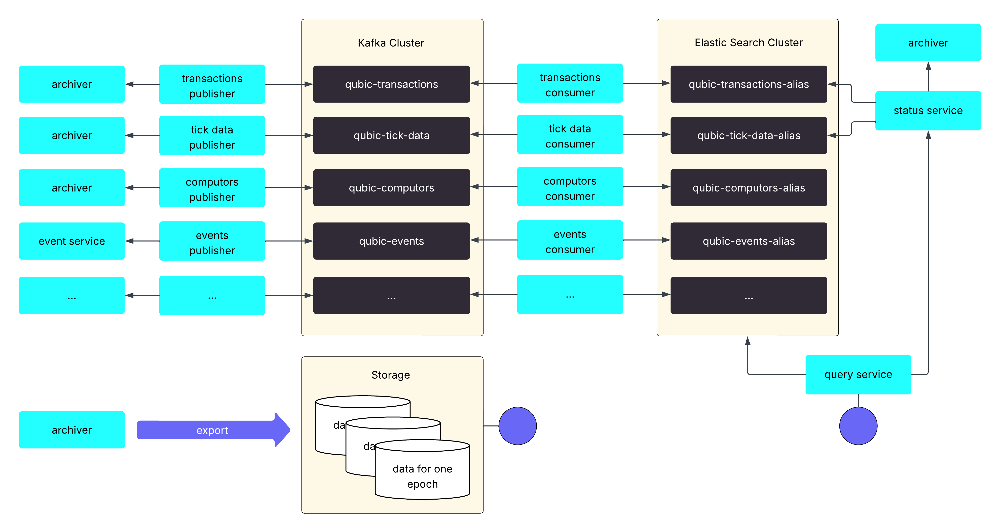

# Integration Layer Revamp

For a while now, Qubic has had an "integration layer" that makes it easy for outside apps like crypto wallets, exchanges, and block explorers to connect to its network. This layer lets these apps do important things like send transactions, check smart contracts, and get information about what's happening on the Qubic network. It's really helpful because developers don't have to learn all the complicated inner workings of Qubic or figure out how to talk directly to its "nodes" (the computers running the network).

However, Qubic is growing fast, and this old integration layer was starting to hit its limits. To keep up with future growth, Qubic began rebuilding this layer at the start of the year. The result is a big upgrade, including a new way to store historical data and upgraded APIs. This new system is built to handle Qubic's expected growth. It officially launched on July 1st, 2025.

While some of the technical details might not be super interesting to the average Qubic user, this new setup is a big deal behind the scenes. It helps make sure everything runs smoothly as Qubic continues to expand.

## Integration APIs

The integration layer provides several different APIs. The most important ones are the live API and the archive API.

The live API talks to the Qubic nodes directly and provides most current data. It fetches information like balances and asset information and allows to send transactions and query smart contracts. The nodes provide a current view onto the data for the current epoch. The live API will remain as is and is not affected by the changes.

The data from the archive API instead provides archived data. The data gets collected from the nodes and finally stored in a database. This API will get replaced with the new archive's API.

## Original solution

The original archive implementation ([qubic-archiver](https://github.com/qubic/go-archiver)) is a fast, monolithic, and specialized solution. It processes the data for every tick, validates it by using quorum data, stores it in an embedded database (pebble), and serves it via grpc and rest-like endpoints. Redundancy is achieved by running several instances in different data centers in parallel. While this solution still works perfectly fine it is not future proof enough to handle the expected growth long term.

To be sustainable long term certain challenges need to be solved. The most important ones are:

* *Load* => be able to scale with the growing number of API requests.
* *Data* => be able to handle large amounts of data.
* *Features* => be able to provide better access to the data.

### Load

Not long ago in beginning 2025 the whole integration layer needed to serve up to 10000 requests per minute. Only six months later this number has doubled and we serve more than 20000 requests per minute at peak times. This load is expected to grow as the Qubic project faces more and more adaption. Furthermore the processing got more resource intensive as the tick time decreased and more transactions are made.

To be able to scale as needed we decided to split the querying part into a separate application so that it can focus on serving the requests and the archiver can focus on processing the data.

### Data

While one year ago the amount of data that we collect was easily manageable we are now storing between 600 GB and 800 GB of data (depending on the compaction status in the database) per archiver instance. The largest part of this data is vote related quorum data that is rarely needed. Event data is not included in these numbers.

As one can imagine it is not easy to handle such large monolithic blocks of data.

To be able to scale with the increasing storage requirements we decided to split the data into different parts and store it in a different places. The parts that are frequently accessed need to be available quickly and well indexed for querying while the parts that are only needed for archiving purpose can be stored in another way.

### Features

The original implementation focuses on performance. In principle the data is organized in a key value store that allows nearly instant access via the provided index. While this is fast, it is not very flexible and limits the possibilities of how to query the data. This, in turn, limits the features for users of the API. Furthermore it is hard to change and extend the way the data is indexed.

To be able to provide the data in a more flexible and less work intensive way, we decided to use a solution that allows to index the data in many ways and that allows us to change the indexing later on, if needed. In addition the new solution should provide API features that allow filtering and paging as needed.

## New solution

As already stated the solution to our challenges was in splitting the system into several parts that are specialized to the required task. For this we needed to

* Create databases for storing the data.
* Create ingestion pipelines for transporting the data.
* Create a service to provide the new query API.
* Handle the asynchronous nature of the new solution.
* Modify the archiver to focus on processing.

The following sections will provide details for each of these items.

### Data storage

We have different kind of data that needs different ways of access and therefore we decided to use different ways of storing the data. There is

* Data that needs to be searchable and is frequently accessed.
* Data that is mainly stored for historical reasons and backup and not frequently accessed.
* Data that is temporarily stored for re-processing, if needed.

```
+------------------+  epoch data   +---------+
|     Archiver     | ------------> | Archive |
+------------------+               +---------+
  |
  | searchable data
  v
+------------------+
|  Search engine   |
+------------------+
```

#### Searchable data

One of the hardest decision was to find a suitable database for the data that needs to be served frequently and with high performance, like transactions, tick data and events. We did experiment with several solutions from relational databases to online cloud solutions but they were not able to handle the expected amount of data well. Finally we decided to go with a search engine and to use [Elasticsearch](https://www.elastic.co/elasticsearch) that is based on [Apache Lucene](https://lucene.apache.org/) but offers additional useful features for clustering and replication. One elasticsearch cluster consists out of at least three nodes to provide enough redundancy (for example for maintenance) and it's possible to have connected remote clusters in different data centers.

The most important searchable data is transaction and tick data. Events are also available but not in production yet. For each kind of searchable data there is one search index within elasticsearch. The index contains the source documents and the indexing information for data retrieval.

From a technical perspective a search index is defined by a search template. The template describes the index and if data is added it will be handled according to the description. To be able to later change the index we use an alias to access every index. That way we can manage the data without the need to change the clients, for example, if we need to re-index the data with a new template version into another index later. So every index looks like this in principle:

```
+-----------+     +-----------+     +--------------+
| xyz-alias | --> | xyz-index | <-- | xyz-template |
+-----------+     +-----------+     +--------------+
```

From the client persepective the data store looks like this:

```
  +--------------------+       +--------------+
  |       client       |   --> | elasticsarch |
  +--------------------+       +--------------+
..........................
: elasticsearch          :
:                        :
: +--------------------+ :
: |  computors-alias   | :
: +--------------------+ :
: +--------------------+ :
: |    events-alias    | :
: +--------------------+ :
: +--------------------+ :
: |  tick-data-alias   | :
: +--------------------+ :
: +--------------------+ :
: | transactions-alias | :
: +--------------------+ :
:                        :
:........................:
```

By splitting the data and only storing the searchable data in elasticsearch the size of this part of the archive got drastically reduced. For example we store (approximately) 160 millions transactions with a dataset size of 90 GB and 16 millions ticks with a dataset size of 30 GB. This includes the source documents and the indices but not the replicated data (multiply by replication factor). Compared to the 600-800 GB for the full archive this is quite comfortable to manage.

#### Archived data

For the data archive we decided to go with a file store where every epoch is stored as a data package. To make this possible we had to change the archiver to be able to split data per epoch and allow it to prune old data to keep the overall data size manageable. The per epoch data gets shipped to a server where it is archived. Third parties can get the data from there and import it. The archive is also useful as a backup.

```
+----------+  data per epoch   +------------+
| archiver | ----------------> |  archive   |
+----------+                   +------------+
                                 ^
                                 |
                                 |
+----------+                   +------------+
| clients  | ----------------> | web server |
+----------+                   +------------+
```

The archive with the per epoch data is work in progress that is not finished yet. Until now only the complete data for all recorded epochs is available in one single database.

#### Temporary data

In the layer between the source (collected data) and the destination (searchable data) we have a temporary data storage where we keep several epochs of collected data that we are able to replay in case of data loss or processing bugs. More details later in the section about data ingestion.

#### Backup and disaster recovery

To be able to restore the data in case of disaster there are several layers in place. First of all there are regular backups of the systems so that we can restore them in case something goes wrong. But it's also possible to restore from scratch. We have intermediary short term storage for replaying the last few epochs without the need of processing the source data again and the archived data that can be use to reimport the old epochs.

### Ingestion pipelines

Ingestion pipelines are used to transport the data from the source (for example the archiver or event service) to the destination (elasticsearch). The data publishing part needs to be decoupled from the source to avoid problems at the source when the backend is not available. Theoretically it would be possible to send the data directly from the publisher to elasticsearch but we decided to decouple it even more by using a messaging system in between to have redundancy, temporary persistence, and the possibility to use data integration features or to scale up the processing with multiple partitions.

We decided to use [Apache Kafka](https://kafka.apache.org/), an open-source distributed event streaming platform. One kafka cluster consists out of at least three nodes to provide proper redundancy.

A typical pipeline shipping data to elasticsearch looks like this:

```
+--------+     +-----------+     +-------+     +----------+     +-------------+
| source | <-- | publisher | --> | topic | <-- | consumer | --> | destination |
+--------+     +-----------+     +-------+     +----------+     +-------------+
```

The publisher (aka producer) collects the data from the source and sends messages to a kafka topic. A kafka topic is a queue of messages. A consumer reads the messages from kafka and sends the data to the destination.

Kafka allows multiple consumer groups to read from one topic and guarantees that each group consumes each message (ordered within one partition). That allows to consume one message in multiple ways. For example we could store the message and in parallel execute advanced data analytics on the incoming information.

We store around 5 epochs of data temporarily within kafka. In case of problems we are able to replay parts of the data quickly. For redundancy we use a replication factor of `3`, that means that 2 nodes per cluster can go offline without affecting the data processing.

At the moment we have 3 ingestion pipelines running in production:

```
                 +------------------------+                    +-----------------------+
  +------------- | transactions-publisher | ------+    +------ | transactions-consumer | ------+
  v              +------------------------+       v    v       +-----------------------+       v
+----------+     |                        |     +--------+     |                       |     +---------------+
| archiver | <-- |  tick-data-publisher   | --> |        | <-- |  tick-data-consumer   | --> | elasticsearch |
+----------+     +------------------------+     | kafka  |     +-----------------------+     +---------------+
  ^              |                        |     |        |     |                       |       ^
  +------------- |  computors-publisher   | --> |        | <-- |  computors-consumer   | ------+
                 +------------------------+     +--------+     +-----------------------+
```

And one additional (events) in development:

```
+------------------+
|  events-service  |
+------------------+
  ^
  |
  |
+------------------+     +-------+     +-----------------+
| events-publisher | --> | kafka | <-- | events-consumer |
+------------------+     +-------+     +-----------------+
                                         |
                                         |
                                         v
                                       +-----------------+
                                       |  elasticsearch  |
                                       +-----------------+

```

The code can be found in the following repositories: [go-data-publisher](https://github.com/qubic/go-data-publisher) and for events in [go-events-publisher](https://github.com/qubic/go-events-publisher) and in [go-events-consumer](https://github.com/qubic/go-events-consumer).

### Query and status services

Because of the decoupling the data publishing part is asynchronous per-se. While this has some advantages it also makes the system more complex on the query side because the archive and the data collection part are not in sync.

#### Status Service

To solve problems with asynchronous ingestion and to provide metadata to the query service we decided to create the [status service](https://github.com/qubic/go-data-publisher/tree/main/status-service) that checks what data is already completely available in the data store. As a nice side effect that service also verifies the ingested data. The status service is a mediator between the query service, the archiver and the searchable data. It makes sure that only completely ingested data is served and also provides some metadata from the archiver that is available in elasticsearch.

```
+---------------+     +----------------+     +----------+
| query service | --> | status service | --> | archiver |
+---------------+     +----------------+     +----------+
  |                     |
  |                     |
  v                     |
+---------------+       |
| elasticsearch | <-----+
+---------------+
```

Another way would have been to use a callback to get notified as soon as data is ingested and we already had this implemented but decided to change it because we are of the opinion that querying the data from the status service makes the architecture much easier to understand and maintain and allows us to validate to some extend that the ingested data is correct.

#### Query Service

The [query service](https://github.com/qubic/archive-query-service) replaced the most important old endpoints transparently (they return the same data but get them from elasticsearch) and created new endpoints. The new endpoints allow to specify filters and ranges and provide a more general interface for pagination. You can find the documentation for the new v2 endpoints [here](https://github.com/qubic/archive-query-service/blob/main/v2/README.md) and the openapi specs [here](https://qubic.github.io/integration/Partners/qubic-rpc-doc.html?urls.primaryName=Qubic%20Query%20V2%20Tree). 

We allow to retrieve the data paginated by offset. Because of performance reasons it is necessary to restrict offset based pagination and we allow a maximum of 10000 search results and one page cannot exceed 1024 items. The query service is hosted at https://api.qubic.org.

It is easiest to show the flexibility of the new API with an example. It is possible to query all burn transactions that exceed one million qubic starting with tick number 25563000 by specifying filters and ranges:

```
curl -X 'POST' \
  'https://api.qubic.org/getTransactionsForIdentity' \
  -H 'accept: application/json' \
  -H 'Content-Type: application/json' \
  -d '{
    "identity": "AAAAAAAAAAAAAAAAAAAAAAAAAAAAAAAAAAAAAAAAAAAAAAAAAAAAAAAAFXIB",
    "filters": {
           "inputType": "0"
    },
    "ranges": {
        "amount": {
            "gt": "1000000"
        },
        "tickNumber": {
            "gte": "25563000"
        }
    },
    "pagination": {
      "size": 1000
    }
}' | jq
```

Queries like these were not possible with the old endpoints. The new API allows 3rd party services to retrieve data much easier than before.

The new API will replace the old deprecated endpoints and the old ones will get removed soon. Information will follow in due time.

### Modifications to the archiver

The [go-archiver](https://github.com/qubic/go-archiver) is still in use but it is going to be refactored step by step to focus more on collecting the data and short term archiving. This is ongoing work that should be finished within the next few months. The new version is needed for completing the long term archive and backup.

The new version will have new features with regard to managing the data per epoch:

* It will produce one data set per epoch for archiving.
* It will enable re-importing a series of sequential epochs.
* It will prune old data as configured (for example keep last 'x' epochs).

As the archiver is important for 3rd party developers and they do not want to run the complete integration infrastructure, many features will stay so that it can be used stand-alone with a basic API. Certain query functionality needs to be removed because of data format changes.

### Overall architecture

In summary, the following diagram gives and overview over the complete architecture at the time of writing this article.



The first parts of the new solution went into production in the April 2025 and in the following months it transparently replaced most of the old archiver endpoints. The full solution was available end of June 2025 and went officially live on July 1st, 2025. Some follow up work like the archiver refactoring for the per epoch archive, is planned to follow until end of this year.

## Summary

Qubic is moving very quickly and is on the verge of becoming a mature project. In order to keep pace with the project growth, it was necessary to adapt the integration layer. Let's recall the challenges that we wanted to solve:

*Load*: we can confidentially serve the load that is to be expected and are able to scale up in the query layer, ingestion layer, and/or in the search layer. Currently the majority of the requests take around 100 milliseconds from receiving the request until responding, if the service is in the same data center than the search layer (we don't have elastic search clusters in all data centers yet).

*Data*: as the data is split, it is easier to manage now and the searchable data size is only a fraction of the total data. We are confident to be able to support many more epochs until we need to scale up the search layer.

*Features*: By using elasticsearch we have a full fledged search engine at hand that provides all the features an API user can dream of. While we cannot expose all these features because of performance and security reasons, the new API is much more flexible and extensible than the old one and supports many new use cases.

We are of the opinion, that all the challenges we faced in the beginning of this year are solved with the new architecture and that we are ready for the bright future of Qubic.

Although the changes are not directly visible to the typical end user, they have a major impact on users of the integration API and on the internals of the integration layer.

The work does not end here, of course. A few more parts need to be completed and refined and then we can and need to focus on new tasks.

All of the code is open source and available at the [qubic github repository](https://github.com/qubic). As always the devs are and the community is eager to answer all your questions in the #dev channel on discord.


